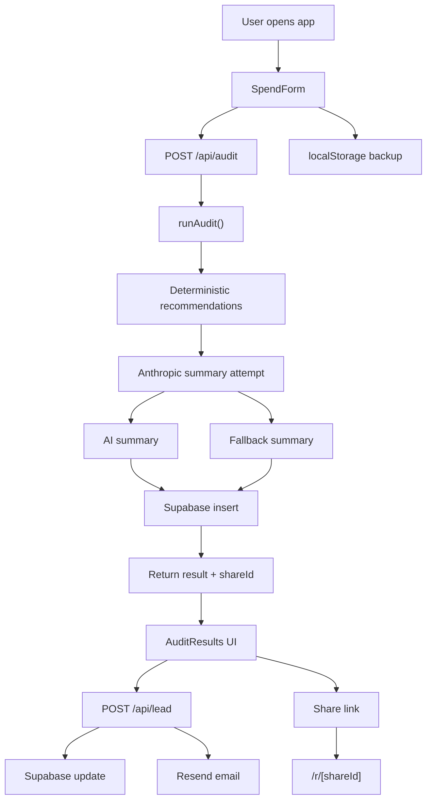

# ARCHITECTURE.md

## System Diagram

## How the app works

The flow is pretty straightforward:

1. The user fills in their team size, use case, tools, and spend.
2. The app posts that input to `/api/audit`.
3. `runAudit()` evaluates the stack using fixed pricing and overlap rules.
4. The app tries to generate a short AI summary from the deterministic result.
5. If that call fails, the app falls back to a plain template summary.
6. The audit is stored in Supabase and returned to the client with a `shareId`.
7. The results page shows the output immediately.
8. If the user shares the audit, the public route loads the stored result without exposing private details.

## Main technical choices

| Layer | Choice | Why |
|---|---|---|
| Framework | Next.js App Router | Simple full-stack setup with routes and share page rendering |
| Language | TypeScript | Safer for pricing logic and data shapes |
| Styling | Tailwind CSS | Fast iteration for a small project |
| Storage | Supabase | Quick setup and easy JSON storage |
| Email | Resend | Lightweight and easy to wire up |
| AI | Anthropic | Used only for the summary paragraph |
| Tests | Jest | Enough for the audit engine without extra ceremony |
| Deploy | Vercel | Obvious fit for this app |

## Notes on scale

If this ever became a real product instead of an assignment project, the main things I would change first are:

- replace the in-memory rate limit with a shared store
- make pricing verification more systematic
- add better event tracking around completion, sharing, and lead capture
- strengthen the public share flow and OG image generation
